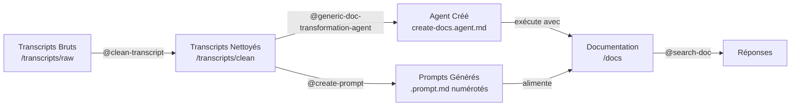

# Transcript to Documentation System

Système automatisé de transformation de transcripts en documentation structurée et interrogeable.

## 📖 Introduction

Ce projet fournit une **suite complète d'outils et agents** pour transformer des transcripts bruts (enregistrements de réunions, entretiens de transfert de connaissances, etc.) en **documentation structurée, navigable et interrogeable**.

La documentation générée peut être recherchée et interrogée via l'**agent de recherche intégré** (`search-doc`), permettant un accès rapide et précis aux informations documentées.

### Pourquoi c'est important

- 📝 **Capture de connaissances** : Transforme des transcripts verbaux en documentation écrite
- 🔍 **Accessibilité** : Rend l'information facilement accessible via recherche intelligente
- 📊 **Structuration** : Organise l'information de manière cohérente et logique
- 🔄 **Réutilisabilité** : Documentation générique utilisable sur n'importe quel projet
- 🤖 **Automatisation** : Utilise GitHub Copilot pour accélérer le processus

---

## 🔧 Prérequis

### Outils requis

- **GitHub Copilot Chat** - Assistant IA pour exécuter les agents
- **Visual Studio Code** - Éditeur de code avec support Copilot Chat
- **Dossier de projet** - Structure préparée avec les dossiers nécessaires

### Versions recommandées

- VS Code: Version récente (2024+)
- GitHub Copilot: Accès activé

### Compétences requises

- Comprendre les bases de Git/GitHub
- Familiarité avec VS Code
- Capacité à suivre des instructions étape par étape

---

## 📦 Installation

### Étape 1: Cloner/Créer le dépôt

```bash
# Option 1: Cloner le dépôt existant
git clone <repository-url>
cd <repository-name>

# Option 2: Créer la structure à partir de zéro
mkdir -p .github/{agents,prompts,instructions}
mkdir -p transcripts/{raw,clean}
mkdir -p docs
mkdir -p temp
```

### Étape 2: Vérifier la structure des fichiers

Assurez-vous que les fichiers suivants existent dans votre projet:

**Fichiers obligatoires**:

```
.github/
├── agents/
│   ├── clean-transcript.agent.md               ← Agent de nettoyage
│   └── search-doc.agent.md                     ← Agent de recherche
├── prompts/
│   ├── generic-doc-transformation-agent.prompt.md  ← Générateur d'agent
│   └── create-prompt.prompt.md                 ← Générateur de prompts
├── instructions/
│   ├── agents.instructions.md                  ← Règles agents
│   ├── markdown.instructions.md                ← Standards markdown
│   ├── process.instructions.md                 ← Process global
│   └── prompt.instructions.md                  ← Standards prompts
└── prompts.config                              ← Configuration centrale

transcripts/
├── raw/                                         ← Transcripts bruts
└── clean/                                       ← Transcripts nettoyés

docs/                                            ← Documentation générée

temp/                                            ← Fichiers temporaires
```

### Étape 3: Configuration initiale

Éditez le fichier `.github/prompts.config` avec vos paramètres de projet:

```yaml
PROJECT_NAME: Your Project Name
AGENT_NAME: create-docs
SOURCE_PATHS:
  - /transcripts/clean/domain1
  - /transcripts/clean/domain2
OUTPUT_PATH: /docs
LANGUAGE: Français
DOMAINS:
  - Domain1
  - Domain2
BATCH_SIZE: 2-4
```

---

## 📁 Description des fichiers et dossiers

### Agents (`.github/agents/`)

#### `clean-transcript.agent.md`
**Rôle**: Agent de nettoyage et structuration de transcripts
- Lit les transcripts bruts (`.transcript`)
- Corrige les erreurs et omissions
- Structure le contenu en markdown
- Applique les standards de formatage
- Produit: Fichiers `.md` structurés dans `/transcripts/clean`
- **Statut**: Agent prérequis (nécessaire au démarrage)

#### `create-docs.agent.md` (généré)
**Rôle**: Agent principal de création de documentation
- **GÉNÉRÉ DYNAMIQUEMENT** par `generic-doc-transformation-agent.prompt.md`
- Lit les transcripts nettoyés
- Les transforme en documentation structurée
- Organise par domaines et sujets
- Génère avec métadonnées (Topics, Related, Source)
- Produit: Documents markdown structurés dans `/docs`
- **Statut**: Créé pendant le processus (pas un prérequis)

#### `search-doc.agent.md`
**Rôle**: Agent de recherche et réponse
- Interroge la documentation générée
- Répond uniquement basé sur la documentation
- Aucune hallucination ou invention
- Fournit sources et citations
- Restriction: Aucune exécution de code
- **Statut**: Agent générique (copy-paste ready)

### Prompts (`.github/prompts/`)

#### `generic-doc-transformation-agent.prompt.md`
**Rôle**: Générateur d'agent de documentation
- Produit un agent `create-docs` personnalisé
- Adapté à votre structure et domaines
- Remplace le template générique
- Entrée: Fichiers source + paramètres
- Sortie: `.github/agents/create-docs.agent.md`

#### `create-prompt.prompt.md`
**Rôle**: Générateur de prompts d'exécution
- Scanne les fichiers source
- Groupe intelligemment par lots (2-4 fichiers)
- Génère tous les prompts d'exécution
- Produit: Prompts pour init + batches + synthèse
- Automation: Batch detection automatique

### Instructions (`.github/instructions/`)

#### `process.instructions.md`
Processus global et flux de travail:
- Description complète du système end-to-end
- Phases et étapes du pipeline
- Flux de données entre composants
- Dépendances et ordonnancement
- Checklists de complétion

#### `agents.instructions.md`
Règles de création pour les fichiers `.agent.md`:
- Structure YAML frontmatter
- Sections obligatoires
- Format et conventions
- Bonnes pratiques

#### `markdown.instructions.md`
Standards de documentation:
- Formatage markdown cohérent
- Structure de documents
- Conventions de nommage
- Métadonnées requises

#### `prompt.instructions.md`
Standards pour fichiers `.prompt.md`:
- Structure et format
- Sections d'instruction
- Best practices
- Validation

### Configuration (`.github/prompts.config`)

Fichier YAML centralisé contenant:
- `PROJECT_NAME`: Nom du projet
- `SOURCE_PATHS`: Emplacements des transcripts
- `OUTPUT_PATH`: Où générer la documentation
- `LANGUAGE`: Langue (ex: Français)
- `DOMAINS`: Domaines/sujets principaux
- `BATCH_SIZE`: Fichiers par batch (2-4)
- `MODEL`: Modèle IA (Claude Sonnet 4.5)
- `TOOLS`: Outils disponibles (read, search)

### Dossiers

#### `transcripts/raw/`
- **Contient**: Fichiers `.transcript` bruts
- **Source**: Enregistrements/transcriptions originales
- **Format**: Texte brut ou formaté
- **Rôle**: Point de départ du processus

#### `transcripts/clean/`
- **Contient**: Fichiers `.md` nettoyés
- **Source**: Transformés depuis les fichiers bruts
- **Format**: Markdown structuré
- **Rôle**: Source pour la génération de documentation

#### `docs/`
- **Contient**: Documentation finale générée
- **Structure**: Organisée par domaines
- **Format**: Markdown avec métadonnées
- **Rôle**: Destination de la documentation

#### `temp/`
- **Contient**: Fichiers temporaires de progression
- **Usage**: Suivi des batches pendant traitement
- **Format**: Fichiers de progression (`agent-progress.md`)
- **Rôle**: Gestion des opérations longues

---

## 🚀 Utilisation

### Flux de travail complet



### Étape 1: Préparer les transcripts bruts

**Action**: Ajouter les transcripts dans `/transcripts/raw/`

```
transcripts/raw/
├── KT_1.transcript
├── KT_2.transcript
└── KT_3.transcript
```

**Format accepté**:
- `.transcript` files (texte brut)
- Contenu: Transcriptions textuelles de réunions/entretiens

### Étape 2: Nettoyer les transcripts

**Outil**: Agent de nettoyage `clean-transcript.agent.md`

**Commande VS Code**:
```
@clean-transcript
Process the transcript "/transcripts/raw/KT_1.transcript"
```

**Note**: Sélectionner l'agent **@clean-transcript** dans l'interface Copilot Chat

**Résultat**: Fichiers `.md` nettoyés dans `/transcripts/clean/`

**Note**: Plusieurs itérations peuvent être nécessaires
- Vérifier la qualité
- Corriger les omissions
- Affiner la structure

### Étape 3: Vérifier les transcripts nettoyés

**Action**: Examiner les fichiers dans `/transcripts/clean/`

```
transcripts/clean/
├── domain1/
│   ├── KT_1.md
│   └── KT_2.md
└── domain2/
    ├── KT_1.md
    └── KT_2.md
```

**Vérifications**:
- ✅ Contenu correct et complet
- ✅ Structure logique
- ✅ Métadonnées présentes
- ✅ Aucune corruption de fichiers

### Étape 4: Générer l'agent de documentation

**Outil**: `generic-doc-transformation-agent.prompt.md`

**Étapes**:
1. Utiliser directement le prompt dans le chat. (les paramètres sont lus depuis `prompts.config`):
   ```
   /generic-doc-transformation-agent Créé moi l'agent
   ```
2. Le prompt génère: `.github/agents/create-docs.agent.md`

**Résultat**:
- Agent personnalisé basé sur votre structure
- Adapté à vos domaines
- Prêt pour exécution

### Étape 5: Créer les prompts d'exécution

**Outil**: `create-prompt.prompt.md`

**Étapes**:
1. Utiliser le prompt dans le chat:
   ```
   /create-prompt Génère moi les prompts
   ```
2. Le prompt auto-détecte:
   - Nombre de fichiers source
   - Groupement optimal en lots
   - Création de tous les prompts

**Résultat**: Fichiers `.prompt.md` numérotés créés dans `.github/prompts/`
- `01-init-docs.prompt.md` - Initialisation
- `02-batch-01.prompt.md`, `03-batch-02.prompt.md`, etc. - Batches de traitement
- `N-cross-references.prompt.md` - Références croisées
- `N+1-summary.prompt.md` - Synthèse finale

### Étape 6: Exécuter les prompts de documentation

**Outil**: Agent généré `create-docs.agent.md`

**Étapes**:

1. **Initialiser** la documentation:
   ```
   @create-docs
   /01-init-docs
   ```

2. **Traiter les batches** (un par un ou parallèle):
   ```
   @create-docs
   /02-batch-01
   
   @create-docs
   //03-batch-02
   ```

3. **Ajouter les références croisées**:
   ```
   @create-docs
   /N-cross-references
   ```

4. **Générer la synthèse**:
   ```
   @create-docs
   /N+1-summary
   ```

**Résultat**: Documentation complète dans `/docs/`

### Étape 7: Interroger la documentation

**Outil**: Agent de recherche `search-doc.agent.md`

**Utilisation**:
```
@search-doc
"Qu'est-ce que [Concept] ?"

@search-doc
"Comment faire [Action] ?"

@search-doc
"Quelle est la différence entre [A] et [B] ?"
```

**Réponses**:
- ✅ Basées UNIQUEMENT sur la documentation
- ✅ Avec citations et sources
- ✅ Indiquant les limitations
- ✅ Suggestions de documents connexes

---

## ⚙️ Détail de la configuration

### Fichier: `.github/prompts.config`

Fichier YAML centralisé contenant tous les paramètres de projet.

### Paramètres principaux

```yaml
# ========================================
# INFORMATIONS DU PROJET
# ========================================
PROJECT_NAME: My Documentation
AGENT_NAME: create-docs
AGENT_DESCRIPTION: Agent de transformation de transcripts en documentation

# ========================================
# CHEMINS ET SOURCES
# ========================================
SOURCE_PATHS:
  - /transcripts/clean/1_Domain_1
  - /transcripts/clean/2_Domain_2
OUTPUT_PATH: /docs

# ========================================
# STRUCTURE ET DOMAINES
# ========================================
DOMAINS:
  - Domain_1
    path: 1_Domain_1
    file_count: X
    description: Mon super domaine 1
  - Domain_2
    path: 2_Domain_2
    file_count: X
    description: Mon super domaine 2

LANGUAGE: Français
TONE: Professional
AUDIENCE: Technical teams and documentation users

# ========================================
# TRAITEMENT PAR LOTS
# ========================================
BATCH_SIZE: 2-4  # Fichiers par batch
PROGRESS_FILE: /temp/[agent-name]-progress.md

# ========================================
# AGENT ET OUTILS
# ========================================
TOOLS: [read, edit, search]
TARGET: vscode
```

### Comment modifier la configuration

**Pour changer le chemin de sortie**:
```yaml
OUTPUT_PATH: /documentation  # Au lieu de /docs
```

**Pour ajouter de nouveaux domaines**:
```yaml
DOMAINS:
  - Domain1
  - Domain2
  - NewDomain
```

**Pour changer la langue**:
```yaml
LANGUAGE: English  # Au lieu de Français
```

**Pour modifier la taille des lots**:
```yaml
BATCH_SIZE: 3-5  # Traiter 3-5 fichiers par batch
```

### Effet des modifications

Les agents et prompts lisant depuis `prompts.config` s'adaptent automatiquement:
- ✅ `generic-doc-transformation-agent.prompt.md` utilise les nuevos paramètres
- ✅ `create-prompt.prompt.md` ajuste les lots
- ✅ `create-docs.agent.md` génère selon la nouvelle structure
- ✅ `search-doc.agent.md` interroge le nouveau `OUTPUT_PATH`

**Aucune modification de code requise!**

---

## 📋 Résumé du workflow

| Étape | Outil | Action | Output |
|-------|-------|--------|--------|
| 1 | Manuel | Ajouter transcripts | `/transcripts/raw/` |
| 2 | @clean-transcript | Nettoyer transcripts | `/transcripts/clean/` |
| 3 | Manuel | Vérifier qualité | ✓ Validation |
| 4 | @generic-doc-transformation-agent | Générer agent | `create-docs.agent.md` |
| 5 | @create-prompt | Générer prompts | `batch-*.md` |
| 6 | @create-docs | Exécuter batches | `/docs/` |
| 7 | @search-doc | Interroger docs | Réponses |

---

## 🆘 Aide et support

### Problèmes courants

**Q: Mon agent ne génère pas la documentation**
A: Vérifiez que `/transcripts/clean/` contient des fichiers et que `OUTPUT_PATH` existe dans `prompts.config`

**Q: La recherche ne retourne aucun résultat**
A: Assurez-vous que la documentation a été générée dans `/docs/` et que le fichier `summary.md` existe

**Q: Comment ajouter de nouveaux domaines?**
A: Modifiez `DOMAINS` dans `.github/prompts.config` et relancez les agents

**Q: Puis-je utiliser le système pour un autre projet?**
A: Oui! Configurez les chemins dans `prompts.config` et exécutez les agents

---

## 📄 Licences et auteurs

- **Projet**: Transcript to Documentation System
- **Agent générique**: Conçu pour la réutilisabilité
- **Basé sur**: GitHub Copilot Chat

---

**Version**: 1.0 (Generic Release)  
**Date**: 2025  
**Statut**: 🚀 Ready
