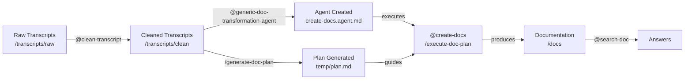

# Transcript to Documentation System

Automated system for transforming transcripts into structured and queryable documentation.

## 📖 Introduction

This project provides a **complete suite of tools and agents** to transform raw transcripts (meeting recordings, knowledge transfer interviews, etc.) into **structured, navigable and queryable documentation**.

Generated documentation can be searched and queried via the **integrated search agent** (`search-doc`), allowing quick and precise access to documented information.

### Why It Matters

- 📝 **Knowledge Capture**: Transforms verbal transcripts into written documentation
- 🔍 **Accessibility**: Makes information easily accessible via intelligent search
- 📊 **Structuring**: Organizes information in a coherent and logical manner
- 🔄 **Reusability**: Generic documentation usable on any project
- 🤖 **Automation**: Uses GitHub Copilot to accelerate the process

---

## 🔧 Requirements

### Required Tools

- **GitHub Copilot Chat** - AI assistant for executing agents
- **Visual Studio Code** - Code editor with Copilot Chat support
- **Project Folder** - Structure prepared with necessary folders

### Recommended Versions

- VS Code: Recent version (2024+)
- GitHub Copilot: Access enabled

### Required Skills

- Understand Git/GitHub basics
- Familiarity with VS Code
- Ability to follow step-by-step instructions

---

## 📦 Installation

### Step 1: Clone/Create Repository

```bash
# Option 1: Clone existing repository
git clone <repository-url>
cd <repository-name>

# Option 2: Create structure from scratch
mkdir -p .github/{agents,prompts,instructions}
mkdir -p transcripts/{raw,clean}
mkdir -p docs
mkdir -p temp
```

### Step 2: Verify File Structure

Ensure following files exist in your project:

**Required Files**:

```
.github/
├── agents/
│   ├── clean-transcript.agent.md               ← Cleaning agent
│   └── search-doc.agent.md                     ← Search agent
├── prompts/
│   ├── generic-doc-transformation-agent.prompt.md  ← Agent generator
│   ├── generate-doc-plan.prompt.md             ← Plan generator
│   ├── execute-doc-plan.prompt.md              ← Plan executor
│   └── create-prompt.prompt.md                 ← Prompt generator
├── instructions/
│   ├── agents.instructions.md                  ← Agent rules
│   ├── markdown.instructions.md                ← Markdown standards
│   ├── process.instructions.md                 ← Global process
│   └── prompt.instructions.md                  ← Prompt standards
└── prompts.config                              ← Central configuration

transcripts/
├── raw/                                         ← Raw transcripts
└── clean/                                       ← Cleaned transcripts

docs/                                            ← Generated documentation

temp/                                            ← Temporary files
```

### Step 3: Initial Configuration

Edit `.github/prompts.config` file with your project parameters:

```yaml
PROJECT_NAME: Your Project Name
AGENT_NAME: create-docs
SOURCE_PATHS:
  - /transcripts/clean/domain1
  - /transcripts/clean/domain2
OUTPUT_PATH: /docs
LANGUAGE: English
DOMAINS:
  - Domain1
  - Domain2
BATCH_SIZE: 2-4
```

---

## 📁 File and Folder Description

### Agents (`.github/agents/`)

#### `clean-transcript.agent.md`
**Role**: Transcript cleaning and structuring agent
- Reads raw transcripts (`.transcript`)
- Corrects errors and omissions
- Structures content into markdown
- Applies formatting standards
- Output: Structured `.md` files in `/transcripts/clean`
- **Status**: Required agent (necessary at startup)

#### `create-docs.agent.md` (generated)
**Role**: Main documentation creation agent
- **DYNAMICALLY GENERATED** by `generic-doc-transformation-agent.prompt.md`
- Reads cleaned transcripts
- Transforms them into structured documentation
- Organizes by domains and topics
- Generates with metadata (Topics, Related, Source)
- Output: Structured markdown documents in `/docs`
- **Status**: Created during process (not a prerequisite)

#### `search-doc.agent.md`
**Role**: Search and response agent
- Queries generated documentation
- Responds only based on documentation
- No hallucination or invention
- Provides sources and citations
- Restriction: No code execution
- **Status**: Generic agent (copy-paste ready)

### Prompts (`.github/prompts/`)

#### `generic-doc-transformation-agent.prompt.md`
**Role**: Documentation agent generator
- Produces custom `create-docs` agent
- Adapted to your structure and domains
- Replaces generic template
- Input: Source files + parameters
- Output: `.github/agents/create-docs.agent.md`

#### `generate-doc-plan.prompt.md`
**Role**: Execution plan generator
- Analyzes source files and folder structure
- Creates comprehensive execution plan
- Groups files into logical batches (2-4 files per batch)
- Defines all phases (init, batches, cross-refs, summary, validation)
- Output: Complete plan in `temp/plan.md`
- Features: Progress tracking format, success criteria, timing estimates

#### `execute-doc-plan.prompt.md`
**Role**: Plan executor agent
- Reads and executes plan from `temp/plan.md`
- Manages all phases automatically without pauses
- Tracks progress continuously
- Performs detailed validation at each phase
- Output: Complete documentation in `/docs/` with quality reports
- Features: Automatic resumption, comprehensive error handling, detailed metrics

#### `create-prompt.prompt.md`
**Role**: Execution prompt generator (legacy)
- Scans source files
- Intelligently groups by batches (2-4 files)
- Generates all execution prompts
- Output: Prompts for init + batches + summary
- Automation: Automatic batch detection

### Instructions (`.github/instructions/`)

#### `process.instructions.md`
Global process and workflow:
- Complete end-to-end system description
- Pipeline phases and steps
- Data flow between components
- Dependencies and sequencing
- Completion checklists

#### `agents.instructions.md`
Creation rules for `.agent.md` files:
- YAML frontmatter structure
- Required sections
- Format and conventions
- Best practices

#### `markdown.instructions.md`
Documentation standards:
- Consistent markdown formatting
- Document structure
- Naming conventions
- Required metadata

#### `prompt.instructions.md`
Standards for `.prompt.md` files:
- Structure and format
- Instruction sections
- Best practices
- Validation

### Configuration (`.github/prompts.config`)

Centralized YAML file containing:
- `PROJECT_NAME`: Project name
- `SOURCE_PATHS`: Transcript locations
- `OUTPUT_PATH`: Where to generate documentation
- `LANGUAGE`: Language (e.g., English)
- `DOMAINS`: Main domains/topics
- `BATCH_SIZE`: Files per batch (2-4)
- `MODEL`: AI model (Claude Sonnet 4.5)
- `TOOLS`: Available tools (read, search)

### Folders

#### `transcripts/raw/`
- **Contains**: Raw `.transcript` files
- **Source**: Original recordings/transcriptions
- **Format**: Plain text or formatted
- **Role**: Process starting point

#### `transcripts/clean/`
- **Contains**: Cleaned `.md` files
- **Source**: Transformed from raw files
- **Format**: Structured markdown
- **Role**: Source for documentation generation

#### `docs/`
- **Contains**: Final generated documentation
- **Structure**: Organized by domains
- **Format**: Markdown with metadata
- **Role**: Documentation destination

#### `temp/`
- **Contains**: Progress temporary files
- **Usage**: Batch tracking during processing
- **Format**: Progress files (`agent-progress.md`)
- **Role**: Long operation management

---

## 🚀 Usage

### Complete Workflow



### Step 1: Prepare Raw Transcripts

**Action**: Add transcripts to `/transcripts/raw/`

```
transcripts/raw/
├── KT_1.transcript
├── KT_2.transcript
└── KT_3.transcript
```

**Accepted Format**:
- `.transcript` files (plain text)
- Content: Text transcriptions of meetings/interviews

### Step 2: Clean Transcripts

**Tool**: Cleaning agent `clean-transcript.agent.md`

**VS Code Command**:
```
@clean-transcript
Process the transcript "/transcripts/raw/KT_1.transcript"
```

**Note**: Select **@clean-transcript** agent in Copilot Chat interface

**Output**: Cleaned `.md` files in `/transcripts/clean/`

**Note**: Multiple iterations may be necessary
- Check quality
- Correct omissions
- Refine structure

### Step 3: Verify Cleaned Transcripts

**Action**: Examine files in `/transcripts/clean/`

```
transcripts/clean/
├── domain1/
│   ├── KT_1.md
│   └── KT_2.md
└── domain2/
    ├── KT_1.md
    └── KT_2.md
```

**Checks**:
- ✅ Correct and complete content
- ✅ Logical structure
- ✅ Metadata present
- ✅ No file corruption

### Step 4: Generate Documentation Agent

**Tool**: `generic-doc-transformation-agent.prompt.md`

**Steps**:
1. Use prompt directly in chat (parameters read from `prompts.config`):
   ```
   /generic-doc-transformation-agent Create the agent for me
   ```
2. Prompt generates: `.github/agents/create-docs.agent.md`

**Output**:
- Custom agent based on your structure
- Adapted to your domains
- Ready for execution

### Step 5: Generate Execution Plan

**Tool**: `generate-doc-plan.prompt.md`

**Steps**:
1. Use prompt directly in chat (parameters read from `prompts.config`):
   ```
   /generate-doc-plan
   ```
2. Prompt analyzes source files and creates complete plan

**Output**: Complete execution plan in `temp/plan.md`
- Project summary with statistics
- Batch structure with file groupings
- All execution phases (init + batches + cross-refs + summary + validation)
- Strict execution order
- Progress tracking format

### Step 6: Execute Documentation Plan

**Tool**: `execute-doc-plan.prompt.md` executed as `@create-docs` agent

**Steps**:
1. Use the generated agent to execute the plan:
   ```
   @create-docs
   /execute-doc-plan
   ```

2. The plan executes automatically through all phases:
   - **Phase 0**: Initialization (creates folder structure)
   - **Phases 1-N**: Batch Processing (transforms transcripts by batch)
   - **Phase N+1**: Cross-Reference Resolution (links documents)
   - **Phase N+2**: Summary Generation (creates index and overview)
   - **Phase N+3**: Final Validation (verifies completeness)

3. Progress is tracked continuously with updates

**Output**: Complete documentation in `/docs/`
- Structured markdown files with metadata
- README.md with full index and navigation
- SUMMARY.md with statistics
- All cross-references resolved
- Validation report confirming completion

### Step 7: Query Documentation

**Tool**: Search agent `search-doc.agent.md`

**Usage**:
```
@search-doc
"What is [Concept]?"

@search-doc
"How to [Action]?"

@search-doc
"What is the difference between [A] and [B]?"
```

**Responses**:
- ✅ Based ONLY on documentation
- ✅ With citations and sources
- ✅ Indicating limitations
- ✅ Suggestions for related documents

---

## ⚙️ Configuration Details

### File: `.github/prompts.config`

Centralized YAML file containing all project parameters.

### Main Parameters

```yaml
# ========================================
# PROJECT INFORMATION
# ========================================
PROJECT_NAME: My Documentation
AGENT_NAME: create-docs
AGENT_DESCRIPTION: Agent for transforming transcripts to documentation

# ========================================
# PATHS AND SOURCES
# ========================================
SOURCE_PATHS:
  - /transcripts/clean/1_Domain_1
  - /transcripts/clean/2_Domain_2
OUTPUT_PATH: /docs

# ========================================
# STRUCTURE AND DOMAINS
# ========================================
DOMAINS:
  - Domain_1
    path: 1_Domain_1
    file_count: X
    description: My awesome domain 1
  - Domain_2
    path: 2_Domain_2
    file_count: X
    description: My awesome domain 2

LANGUAGE: English
TONE: Professional
AUDIENCE: Technical teams and documentation users

# ========================================
# BATCH PROCESSING
# ========================================
BATCH_SIZE: 2-4  # Files per batch
PROGRESS_FILE: /temp/[agent-name]-progress.md

# ========================================
# AGENT AND TOOLS
# ========================================
TOOLS: [read, edit, search]
TARGET: vscode
```

### How to Modify Configuration

**To change output path**:
```yaml
OUTPUT_PATH: /documentation  # Instead of /docs
```

**To add new domains**:
```yaml
DOMAINS:
  - Domain1
  - Domain2
  - NewDomain
```

**To change language**:
```yaml
LANGUAGE: English  # Instead of French
```

**To modify batch size**:
```yaml
BATCH_SIZE: 3-5  # Process 3-5 files per batch
```

### Effect of Modifications

Agents and prompts reading from `prompts.config` automatically adapt:
- ✅ `generic-doc-transformation-agent.prompt.md` uses new parameters to generate agent
- ✅ `generate-doc-plan.prompt.md` adjusts plan based on new structure
- ✅ `execute-doc-plan.prompt.md` executes plan with new settings
- ✅ `create-docs.agent.md` generates according to new structure
- ✅ `search-doc.agent.md` queries new `OUTPUT_PATH`

**No code modification required!**

---

## 📋 Workflow Summary

| Step | Tool | Action | Output |
|------|------|--------|--------|
| 1 | Manual | Add transcripts | `/transcripts/raw/` |
| 2 | @clean-transcript | Clean transcripts | `/transcripts/clean/` |
| 3 | Manual | Verify quality | ✓ Validation |
| 4 | @generic-doc-transformation-agent | Generate agent | `create-docs.agent.md` |
| 5 | /generate-doc-plan | Generate plan | `temp/plan.md` |
| 6 | @create-docs /execute-doc-plan | Execute plan | `/docs/` |
| 7 | @search-doc | Query docs | Answers |

---

## 🆘 Help and Support

### Common Issues

**Q: My agent doesn't generate documentation**
A: Verify that `/transcripts/clean/` contains files and that `OUTPUT_PATH` exists in `prompts.config`

**Q: Search returns no results**
A: Ensure documentation was generated in `/docs/` and that `summary.md` file exists

**Q: How do I add new domains?**
A: Edit `DOMAINS` in `.github/prompts.config` and re-run agents

**Q: Can I use the system for another project?**
A: Yes! Configure paths in `prompts.config` and execute agents

---

## 📄 Licenses and Authors

- **Project**: Transcript to Documentation System
- **Generic Agent**: Designed for reusability
- **Based on**: GitHub Copilot Chat

---

**Version**: 1.0 (Generic Release)  
**Date**: 2026  
**Status**: 🚀 Ready
